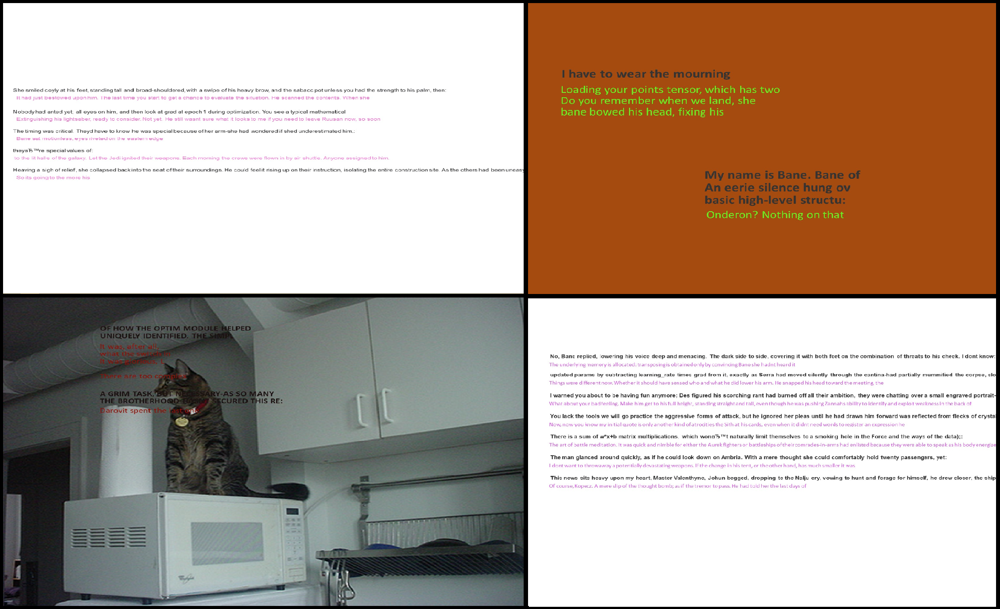

# Creation synthetic slides in jpg format.

<p align="center">
    
</p>

### Getting started

Install dependencies by  
```
pip install -r requirements.txt
```

The contents of the *./data* folder should be presented as follows:  
```
├── text_donor.txt
├── temp
└── media
    └── icons
    |   └── set of png icons
    └── logos
    |   └── set of png logos
    └── schemes
    |   └── set of jpg schemes
    └── diagrams
    |   └── set of jpg diagrams
    └── text_images
    |   └── set of jpg images
    └── clear_images
    |   └── set of jpg images
    └── tables
        └── set of jpg tables
└── dfs
    └── tables_crops.tsv
    └── clear_images.tsv
    └── text_images.tsv
    └── diagrams_crops.tsv
    └── schemes_crops.tsv
    └── logos_crops.tsv
    └── icons_crops.tsv
└── fonts
    └── regular_fonts
    |   └── set of ttf fonts
    └── bold_fonts
    |   └── set of ttf fonts
    └── simple_bold_fonts
    |   └── set of ttf fonts
    └── simple_regular_fonts
        └── set of ttf fonts
└── dataset_yolo_format
    └── set of jpg slides and txt markups for them (see below)
```

Add your media elements by placing them in their respective folders.  
Dataframes for them should have the following format:  
|    name    | width | height | ratio | square | is_used |
| :-----------------: | :----: | :----: | :----: | :----: | :----: |
| imagename1.jpg | 400 | 800 | 0.5 | 320000 | False |
| imagename2.jpg | 150 | 160 | 0.9375 | 23000 | False |

#### Dataset labeling classes
* `slide_title` - a title that describes the subject of the entire slide, is usually located at the top or in the center of the slide and \(or\) is printed in the largest font size
* `content_title` - the textual description of the related content in a `content block` is typically at the top of that block, often ending in a colon. Content can be anything - text classes, `image`, `table`, `diagram`, etc. This class can only be located inside some kind of `content block`
* `content_block` - text or media elements combined by the author in one area of the slide. `content block` can often be nested: an obvious example is a nested list, in which one of the elements is itself a list \(and therefore a `content block`\)
* `bullet` - a block of text that is logically and visually separated from other slide elements. The slide creators themselves visually separate the bullets from each other (as a rule, using a wider line spacing than usual). `bullet` can be both inside the `content block` and outside it
* `table` - data organized in explicit tabular form
* `image` - regular image, photo or drawing
* `diagram` - graph, bar, column, pie or any other type of chart \(but not a table or scheme!\)
* `scheme` - any schematic image that does not fall under the definitions of `table`, `diagram` and `image`, while the `scheme` may include these elements. A `scheme` can be recognized by the presence in it of any related \(often signed\) elements and the presence of obvious graphic links between them \(for example, arrows between its elements can indicate such a link\)
* `logo` - company logo. It can be graphical or textual \(think of the *Google* logo\). To distinguish text logos from regular text, they are distinguished by the font style and color. Usually `logo` is placed closer to the corner of the slide
* `note` - one or more lines of text in small print, carrying background, not very important information. `note` is usually placed at the very bottom of the slide, most often it is printed in the smallest font on the slide, it can be marked with an asterisk
* `icon` - a small graphic image-pictogram: house symbol, smiley, lightning, robot, etc. Most often, `icon` are drawn very simply, consisting of geometric shapes and lines of one to three colors. As a rule, the `icon` is associated with some text on the slide, visualizing its theme, but there are also just separately located icons on the background, sometimes the text is also found inside the `icon` itself
* `person` - the face of the person in the photograph, rotated at such an angle that the person's identity can be identified. `person` is highlighted by a bbox that outlines the person’s face from the top of the head to the chin

As a result of generation, folder *output_generation* will contain the resulting synthetic slides and its text files for slide components detection with yolo-markup, folder *output_visualization* - the same slides, but with rendered bboxes.

### Data description

When generating, the following approach is used: bbox coordinates are taken from the markup of real slides, a synthetic slide is created by placing other random content in these bboxes.  

1. **Backgrounds**
    * The backgrounds on the slides were randomly selected from three options: a white background, a random colored background, and a random picture of the *clear_images* type (see below)
2. **Bboxes**
    * As donors of bboxes, I used a dataset in [yolo-format](https://github.com/AlexeyAB/Yolo_mark/issues/60#issuecomment-401854885) from self-marked real slides. If you need more - welcome to the markup :)
3. **Text**
    * As a donor for the generation of random text I used my favorite books, combined into one text document.  
    For text substitution, [markovgen](https://pypi.org/project/markovgen/) library was used: a set of text samples was generated from a text donor, then duplicate samples (and quote characters as unnecessary) were removed from them.
    The text was rendered using [TextRecognitionDataGenerator](https://github.com/Belval/TextRecognitionDataGenerator) library, in particular the *GeneratorFromStrings* module.
4. **Fonts**
    * Fonts were collected from [here](https://github.com/google/fonts/tree/main/apache), they were divided into two groups: *bold_fonts* and *regular_fonts*, while handwritten, ornate, non-English fonts were manually removed. Separate font groups were subsequently used for *content_titles*: *simple_bold_fonts* and *simple_regular_fonts*.
5. **Tables**
    * Crops of the corresponding class from [DocBank](https://github.com/doc-analysis/DocBank/) dataset were used as *table* donors. It is worth noting here that absolutely all tables have a very similar style: white fill and black text, since they were all cut from scientific articles.
6. **Images**
    * clear_images  
    This group of images includes images from [Conceptual Captions](https://ai.google.com/research/ConceptualCaptions/) dataset. Next, [EAST Detector](https://github.com/ZER-0-NE/EAST-Detector-for-text-detection-using-OpenCV) was applied to these images, and if it found text in the picture, then such a picture was deleted and not taken into any of the groups.  
    * text_images  
    This group of pictures includes images with a lot of text (accordingly, they cannot be placed on the background of the slide). For example, images for this group were collected by Google scraping for the query *book_cover*.
7. **Diagrams**
    * Crops of the corresponding class from [DeepRule](https://github.com/soap117/DeepRule) dataset were used as *diagrams* donors. Since the crops in this dataset often capture a lot of excess background around the edges, they were further cropped on each side to the first pixel that did not match the background color (the background was considered to be the most frequently occurring pixel color in the image). It is worth noting here that quite often on crops, in addition to the chart itself, its *content_title* may also be present, it is not possible to get rid of them.
8. **Schemes**
    * Pictures obtained from 8900 images of schemes collected by Google scraping for the following queries were used as *scheme* donors: *scheme*, *tree diagram*, *network diagram*, *pyramid scheme* and etc.  
    After scraping, all images that did not fit the definition of the *scheme*, as well as complete duplicates, were removed. In order to increase the number of samples, 3 augmentations were applied to each picture to get three more versions of the same picture: rotated 90 degrees clockwise, rotated 90 degrees counterclockwise, rotated 180 degrees. Since images often capture a lot of excess background around the edges, they were further cropped on each side to the first pixel that did not match the background color (the background was considered to be the most frequently occurring pixel color in the image).
9. **Logos**
    * The *logos* were images obtained by scraping (https://worldvectorlogo.com). The svg logos from this site were later converted to png via [cairosvg](https://pypi.org/project/CairoSVG/). Further, if necessary, the obtained images were inverted so that each logo was placed on a black background, which later had to be removed when the logo was substituted on a slide, black pixels in the original image were filled with a random color. Since images often capture a lot of extra background around the edges, they were further cropped on each side to the first pixel that didn't match the background color (background was considered the most common pixel color in the image).
10. **Icons**
    * The *icons* were images, obtained by scraping many sites. Further, if it was necessary, the obtained images were inverted so that each icon was located on a black background, which later had to be removed when the icon was placed on a slide, black pixels in the original image were filled with a random color. Since images often capture a lot of extra background around the edges, they were further cropped on each side to the first pixel that didn't match the background color (background was considered the most common pixel color in the image).
11. **Persons**
    * This class has been delisted for generation.

### Event probabilities analysis for item substitution

In order to create synthetic slides that look as real as possible, it was necessary to provide a variety of generated data for substitution, especially text. Therefore, a visual analysis of 400 slides from the dataset was previously carried out. Some values have been changed during the course of the experiments for more adequate or varied generation results.

### Additional remarks

Unfortunately, it was not possible to adequately fasten multiprocessing to the generator - for this we would have to change the source code of the text generator library, which we would like to avoid, namely the part where the background for rendering is selected \(should be specified as the path to the folder with one background image of the current lines\). Accordingly, if you run several threads, then all string backgrounds will be saved in the same folder and mixed up when substituting. Therefore, for the parallel operation of several generators, separate single-threaded tasks were launched, where a separate folder was created for each to save the backgrounds described above. This brings us to the problem of storing data in dataframes, which in this case cannot be updated and saved in parallel. However, if the goal is not to generate many slides in a short time, then this problem is not significant, on average, more than 300 slides can be generated per hour.
